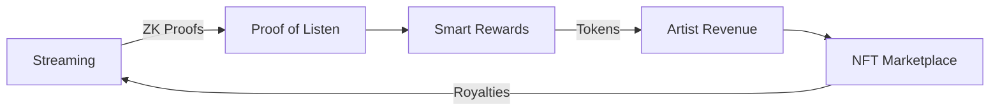
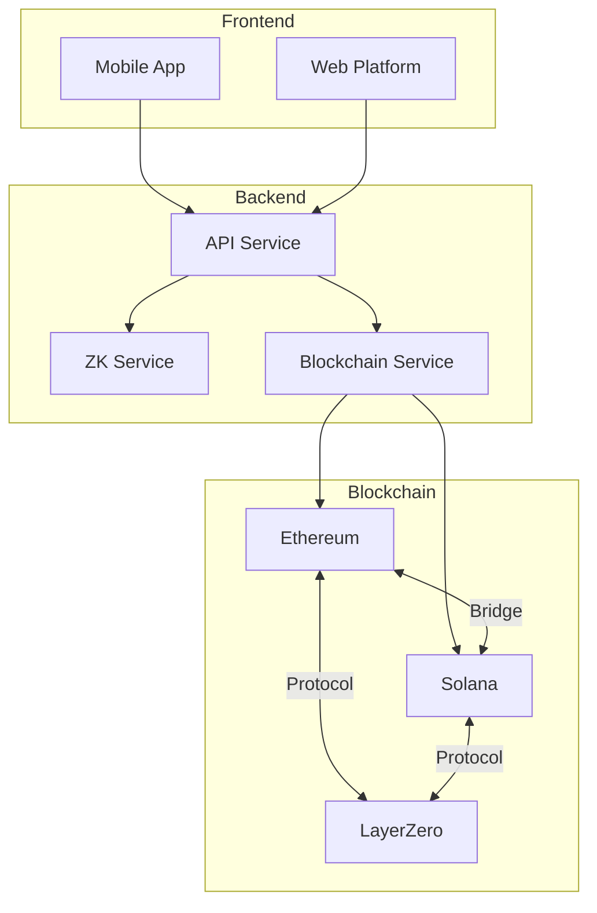
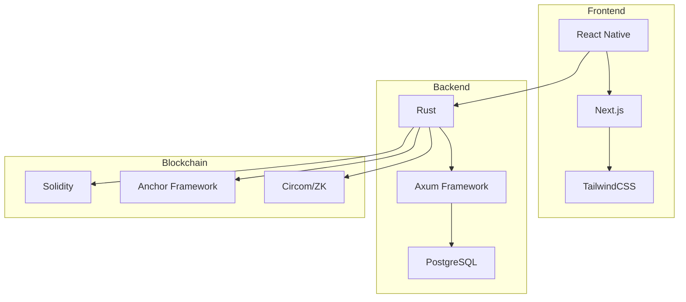

# VibeStream 🎵 

> Revolutionizing music streaming through blockchain technology and zero-knowledge proofs

## Vision
VibeStream is a decentralized music streaming platform that empowers artists and listeners through blockchain technology. We're building a fair, transparent, and innovative ecosystem where artists are properly compensated and fans can truly engage with their favorite music.

## Core Features 🚀



### 1. Proof of Listen System
- Verifiable listening time through zero-knowledge proofs
- Fair compensation based on actual engagement
- Anti-fraud mechanisms built-in

### 2. Multi-Chain Integration
- Ethereum for main contracts and governance
- Solana for high-speed transactions and NFTs
- Cross-chain compatibility via LayerZero

### 3. Artist Empowerment
- Direct fan engagement
- Transparent royalty distribution
- NFT-based exclusive content

## Technical Architecture 🏗️



## Roadmap 🗺️

### Phase 1: Foundation (Q2 2024)
- [x] Core architecture design
- [x] Smart contract development
- [x] Zero-knowledge proof implementation
- [ ] Basic streaming functionality

### Phase 2: Integration (Q3 2024)
- [ ] Multi-chain bridge deployment
- [ ] Mobile app beta
- [ ] Artist onboarding platform
- [ ] NFT marketplace launch

### Phase 3: Expansion (Q4 2024)
- [ ] Governance token launch
- [ ] Community features
- [ ] Advanced recommendation system
- [ ] International market expansion

### Phase 4: Innovation (2025)
- [ ] AI-powered features
- [ ] Virtual concerts integration
- [ ] Social features expansion
- [ ] Enterprise partnerships

## Technology Stack 💻



## Getting Started 🚀

```bash
# Clone the repository
git clone https://github.com/yourusername/vibestream

# Install dependencies
cd vibestream
cargo build
npm install

# Run development environment
docker-compose up -d
cargo run
```

## Documentation 📚
- [Technical Documentation](./docs/technical.md)
- [API Reference](./docs/api.md)
- [Smart Contracts](./docs/contracts.md)
- [Zero-Knowledge System](./docs/zk-system.md)

## Contributing 🤝
We welcome contributions! Please see our [Contributing Guidelines](CONTRIBUTING.md) for details.

## Security 🔒
Security is our top priority. For details about our security measures and audit reports, see [Security](SECURITY.md).

## License 📄
VibeStream is licensed under the [MIT License](LICENSE).

---

<div align="center">

[](https://discord.gg/vibestream)
[](https://twitter.com/vibestream)

</div>

