d# VibeStream Project Restructuring 🏗️

## Current Challenges 🚧

### Dependency Conflicts

```mermaid
graph TD
    subgraph "Current Issues"
        T1[tokio v1.14.1<br/>Required by Solana]
        T2[tokio ≥1.18<br/>Required by Ethers]
        T3[tokio ≥1.25<br/>Required by Axum]
        Z1[zeroize conflicts<br/>between SQLx and Solana]
    end

    subgraph "Affected Components"
        BC[Backend Core]
        ES[Ethereum Service]
        SS[Solana Service]
        WS[Web Service]
    end

    T1 -->|blocks| BC
    T2 -->|blocks| BC
    T3 -->|blocks| BC
    Z1 -->|affects| BC
```


### Current Architecture Problems
1. **Tight Coupling**
   - All blockchain operations in one crate
   - Shared dependencies causing conflicts
   - Hard to update individual components

2. **Version Conflicts**
   - Solana requires older tokio
   - Ethereum needs newer tokio
   - Web framework needs latest tokio

3. **Maintenance Issues**
   - Hard to test components independently
   - Difficult to update dependencies
   - Complex error handling

## Proposed Solution 🎯

### New Architecture


### Benefits
1. **Independent Services**
   - Each service manages its own dependencies
   - No version conflicts
   - Easier updates and maintenance

2. **Clear Boundaries**
   - Well-defined interfaces
   - Message-based communication
   - Better error isolation

3. **Scalability**
   - Services can be scaled independently
   - Better resource utilization
   - Easier deployment

## Implementation Plan 📋

### Phase 1: Foundation
1. Create `shared-types` crate
   - Define common interfaces
   - No external dependencies
   - Pure Rust types

2. Setup message queue
   - Redis or RabbitMQ
   - Define message formats
   - Setup connection handling

### Phase 2: Service Separation
1. Create new service crates
   ```
   backend/
   ├── api-service/      # Web API (Axum)
   ├── ethereum-service/ # ETH operations
   ├── solana-service/   # SOL operations
   └── shared-types/     # Common interfaces
   ```

2. Migrate functionality
   - Move Ethereum code to ethereum-service
   - Move Solana code to solana-service
   - Update API endpoints

### Phase 3: Communication
1. Implement message patterns
   ```mermaid
   sequenceDiagram
       API->>Queue: Publish Request
       Queue->>Ethereum: Consume Request
       Ethereum->>Queue: Publish Result
       Queue->>API: Consume Result
   ```

2. Setup error handling
   - Retry mechanisms
   - Dead letter queues
   - Monitoring

## Migration Strategy 🔄

### Step 1: Preparation
```bash
# Create new crates
cargo new api-service
cargo new ethereum-service
cargo new solana-service
cargo new shared-types
```

### Step 2: Shared Types
```rust
// shared-types/src/lib.rs
pub mod blockchain {
    pub struct Transaction {
        pub hash: String,
        pub amount: u64,
        // ...
    }
}
```

### Step 3: Service Implementation
```rust
// ethereum-service/src/lib.rs
use shared_types::blockchain::Transaction;

pub async fn process_transaction(tx: Transaction) {
    // Implementation
}
```

## Monitoring & Metrics 📊

### Key Metrics
- Service response times
- Queue lengths
- Error rates
- Resource usage

### Health Checks
- Service status
- Queue connectivity
- Blockchain node status

## Next Steps 👣

1. [ ] Create shared-types crate
2. [ ] Setup message queue infrastructure
3. [ ] Migrate Ethereum functionality
4. [ ] Migrate Solana functionality
5. [ ] Implement API gateway
6. [ ] Setup monitoring
7. [ ] Deploy services
8. [ ] Load testing 