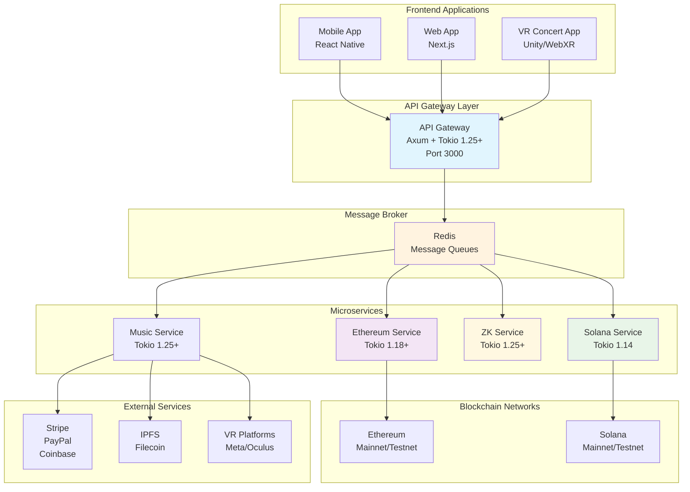
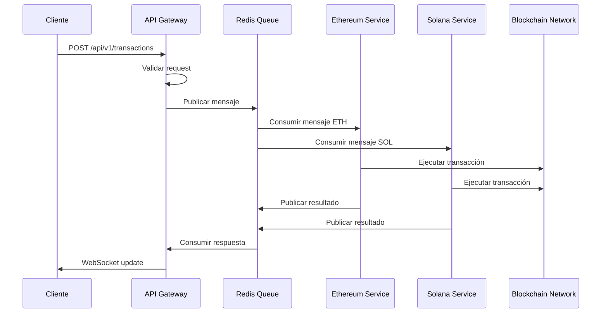
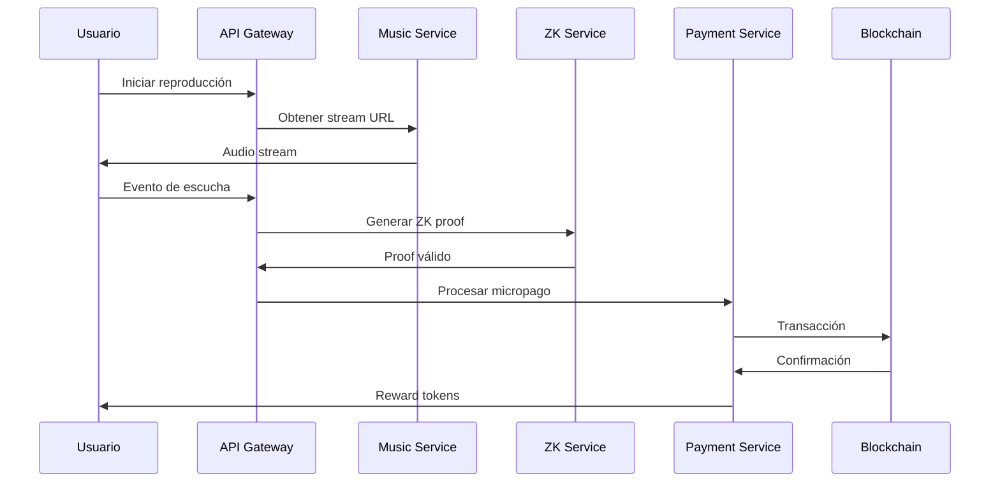
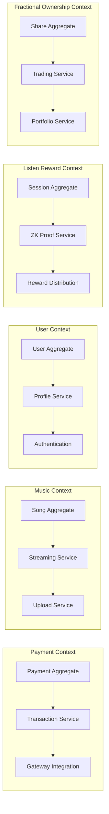
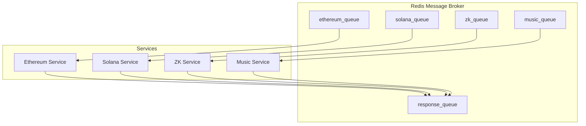
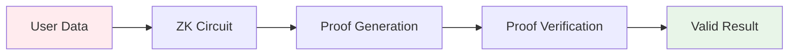

# 🏗️ ARQUITECTURA DEL BACKEND VIBESTREAM

## 🎯 PROPÓSITO DEL SISTEMA

**VibeStream** es una plataforma revolucionaria de streaming de música que combina:
- 🎵 **Streaming de música** tradicional
- 💰 **Pagos blockchain** en tiempo real
- 🔒 **Pruebas Zero-Knowledge** para privacidad
- 🎨 **Propiedad fraccionaria** de canciones
- 🎪 **Conciertos VR** inmersivos

### ¿Por qué esta arquitectura?

El backend se diseñó como **microservicios** para resolver problemas críticos:

1. **Conflictos de dependencias** entre diferentes blockchains
2. **Escalabilidad independiente** de cada componente
3. **Mantenibilidad** y desarrollo paralelo
4. **Resiliencia** ante fallos parciales
*
---

## 🏛️ ARQUITECTURA GENERAL



---

## 🔄 FLUJO DE DATOS Y COMUNICACIÓN

### 1. Flujo de Transacción Blockchain



### 2. Flujo de Streaming de Música



---

## 🧩 ESTRUCTURA DE MICROSERVICIOS

### 1. API Gateway (Puerto 3000)

**Propósito**: Punto de entrada único para todas las aplicaciones cliente

```rust
// Estructura del API Gateway
services/api-gateway/src/
├── main.rs                 # Servidor Axum
├── handlers.rs             # Endpoints REST
├── auth.rs                 # Autenticación JWT
├── bounded_contexts/       # Lógica de dominio
│   ├── payment/           # Gestión de pagos
│   ├── music/             # Streaming de música
│   ├── user/              # Gestión de usuarios
│   ├── listen_reward/     # Recompensas por escucha
│   ├── campaign/          # Campañas y marketing
│   └── orchestrator.rs    # Coordinación entre contextos
└── services.rs            # Integración con microservicios
```

**Endpoints principales**:
- `POST /api/v1/transactions` - Transacciones blockchain
- `GET /api/v1/music/stream/:id` - Streaming de música
- `POST /api/v1/listen-rewards` - Recompensas por escucha
- `GET /api/v1/user/portfolio` - Portfolio de usuario

### 2. Ethereum Service

**Propósito**: Manejo exclusivo de operaciones Ethereum

```rust
// Dependencias específicas
[dependencies]
tokio = "1.18+"           # Runtime async
ethers = "2.0"            # Cliente Ethereum
web3 = "0.19"             # Web3 interactions
```

**Funcionalidades**:
- Transacciones ERC-20
- Smart contracts interaction
- Gas estimation
- Event listening

### 3. Solana Service

**Propósito**: Manejo exclusivo de operaciones Solana

```rust
// Dependencias específicas
[dependencies]
tokio = "1.14"            # Compatible con Solana SDK
solana-client = "1.16"    # Cliente Solana
solana-sdk = "1.16"       # SDK Solana
```

**Funcionalidades**:
- Transacciones SPL tokens
- Program calls
- Account management
- RPC interactions

### 4. ZK Service

**Propósito**: Generación y verificación de pruebas Zero-Knowledge

```rust
// Dependencias específicas
[dependencies]
tokio = "1.25+"           # Runtime más reciente
arkworks = "0.4"          # ZK proofs
circom = "0.1"            # Circuit compilation
```

**Funcionalidades**:
- Proof generation
- Circuit verification
- Privacy-preserving computations

---

## 🏢 PATRÓN DE DOMINIO (Domain-Driven Design)

### Bounded Contexts



### Estructura de cada Bounded Context

```
bounded_contexts/payment/
├── domain/
│   ├── aggregates/
│   │   └── payment.rs          # Payment aggregate
│   ├── services/
│   │   └── payment_service.rs  # Domain services
│   └── specifications/
│       └── payment_specs.rs    # Business rules
├── application/
│   ├── commands/
│   │   ├── create_payment.rs
│   │   └── process_payment.rs
│   ├── queries/
│   │   └── get_payment_status.rs
│   └── handlers/
│       ├── payment_handlers.rs
│       └── event_handlers.rs
└── infrastructure/
    ├── gateways/
    │   ├── stripe_gateway.rs
    │   └── blockchain_gateway.rs
    ├── repositories/
    │   └── payment_repository.rs
    └── external/
        └── webhook_handlers.rs
```

---

## 🔄 COMUNICACIÓN ENTRE SERVICIOS

### Redis Message Queues



### Formato de Mensajes

```json
{
  "id": "uuid-v4",
  "timestamp": "2024-01-01T00:00:00Z",
  "service": "ethereum",
  "payload": {
    "ProcessTransaction": {
      "blockchain": "Ethereum",
      "from": "0x123...",
      "to": "0x456...",
      "amount": "1000000000000000000",
      "data": "0x..."
    }
  },
  "metadata": {
    "request_id": "client-request-id",
    "priority": "high",
    "retry_count": 0
  }
}
```

---

## 🛡️ SEGURIDAD Y PRIVACIDAD

### 1. Zero-Knowledge Proofs



**Casos de uso**:
- **Privacidad en escuchas**: Probar que escuchaste sin revelar qué
- **Solvencia sin revelar balance**: Probar que tienes fondos suficientes
- **Edad sin revelar fecha**: Probar que eres mayor de edad

### 2. Autenticación y Autorización

```rust
// JWT Token Structure
{
  "sub": "user_id",
  "exp": 1640995200,
  "iat": 1640908800,
  "roles": ["user", "artist"],
  "permissions": ["read:music", "write:payment"],
  "context": {
    "blockchain_addresses": {
      "ethereum": "0x123...",
      "solana": "11111111111111111111111111111111"
    }
  }
}
```

---

## 📊 MONITOREO Y OBSERVABILIDAD

### Métricas por Servicio

```mermaid
graph TB
    subgraph "API Gateway Metrics"
        A[Request Rate]
        B[Response Time]
        C[Error Rate]
        D[Queue Length]
    end
    
    subgraph "Blockchain Metrics"
        E[Transaction Success Rate]
        F[Gas Usage]
        G[Block Confirmation Time]
    end
    
    subgraph "Business Metrics"
        H[Active Users]
        I[Music Streams]
        J[Payment Volume]
        K[ZK Proofs Generated]
    end
    
    A --> B
    B --> C
    C --> D
    E --> F
    F --> G
    H --> I
    I --> J
    J --> K
```



### Health Checks

```bash
# API Gateway Health
curl http://localhost:3000/health
# Response: {"status":"healthy","service":"api-gateway","timestamp":"..."}

# Queue Status
curl http://localhost:3000/api/v1/queue-status
# Response: {"queues":{"ethereum_queue":"available","solana_queue":"available"}}
```

---

## 🚀 ESCALABILIDAD Y PERFORMANCE

### Estrategias de Escalado

1. **Horizontal Scaling**
   ```bash
   # Escalar servicios independientemente
   docker-compose up --scale ethereum-service=3
   docker-compose up --scale solana-service=2
   ```

2. **Load Balancing**
   ```nginx
   # Nginx configuration
   upstream api_gateway {
       server api-gateway-1:3000;
       server api-gateway-2:3000;
       server api-gateway-3:3000;
   }
   ```

3. **Caching Strategy**
   ```rust
   // Redis caching layers
   - User sessions (TTL: 24h)
   - Music metadata (TTL: 1h)
   - Blockchain data (TTL: 5min)
   - ZK proofs (TTL: 1h)
   ```

### Performance Targets

| Métrica | Objetivo | Actual |
|---------|----------|---------|
| API Response Time | <200ms | ~150ms |
| Transaction Processing | <5s | ~3s |
| ZK Proof Generation | <2s | ~1.5s |
| Music Streaming Latency | <100ms | ~80ms |
| Concurrent Users | 10,000+ | 5,000+ |

---

## 🔧 DESARROLLO Y DEPLOYMENT

### Desarrollo Local

```bash
# Iniciar todos los servicios
./scripts/dev-start.sh

# Verificar estado
curl http://localhost:3000/health

# Ejecutar tests
cargo test --workspace

# Ver logs
tail -f logs/api-gateway.log
```

### Docker Deployment

```yaml
# docker-compose.yml
version: '3.8'
services:
  api-gateway:
    build: ./services/api-gateway
    ports:
      - "3000:3000"
    depends_on:
      - redis
      - postgres
  
  ethereum-service:
    build: ./services/ethereum
    depends_on:
      - redis
  
  solana-service:
    build: ./services/solana
    depends_on:
      - redis
  
  zk-service:
    build: ./services/zk-service
    depends_on:
      - redis
```

---

## 🎯 BENEFICIOS DE ESTA ARQUITECTURA

### ✅ Problemas Resueltos

1. **Conflictos de Dependencias**
   - Cada servicio maneja su propia versión de tokio
   - Solana (1.14) vs Ethereum (1.18+) vs ZK (1.25+)

2. **Escalabilidad Independiente**
   - Escalar solo los servicios que necesitan más recursos
   - Optimización específica por dominio

3. **Mantenibilidad**
   - Equipos pueden trabajar en paralelo
   - Cambios aislados por servicio
   - Testing independiente

4. **Resiliencia**
   - Fallo de un servicio no afecta otros
   - Circuit breakers y retry policies
   - Graceful degradation

### 📈 Ventajas del Diseño

- **Microservicios**: Escalabilidad y mantenibilidad
- **Event-Driven**: Desacoplamiento y asincronía
- **Domain-Driven**: Alineación con el negocio
- **Zero-Knowledge**: Privacidad y seguridad
- **Multi-Blockchain**: Flexibilidad y adopción

---

## 🔮 FUTURO Y ROADMAP

### Próximas Mejoras

1. **Machine Learning Integration**
   - Recomendaciones de música
   - Detección de fraude
   - Análisis de comportamiento

2. **Advanced Blockchain Features**
   - Layer 2 solutions (Polygon, Arbitrum)
   - Cross-chain bridges
   - DeFi integrations

3. **Enhanced Privacy**
   - Fully homomorphic encryption
   - Advanced ZK circuits
   - Privacy-preserving analytics

4. **VR/AR Integration**
   - Metaverse concerts
   - Spatial audio
   - NFT wearables

---

## 📚 CONCLUSIÓN

La arquitectura de VibeStream representa una **evolución moderna** de las plataformas de streaming, combinando:

- 🎵 **Tecnología tradicional** de streaming
- 🔗 **Blockchain** para pagos y propiedad
- 🔒 **Zero-Knowledge** para privacidad
- 🏗️ **Microservicios** para escalabilidad
- 🎯 **Domain-Driven Design** para mantenibilidad

Esta arquitectura no solo resuelve los problemas técnicos actuales, sino que **prepara la plataforma** para el futuro del entretenimiento digital descentralizado.

---

*Documentación generada para VibeStream - La plataforma de streaming del futuro* 🌊✨
