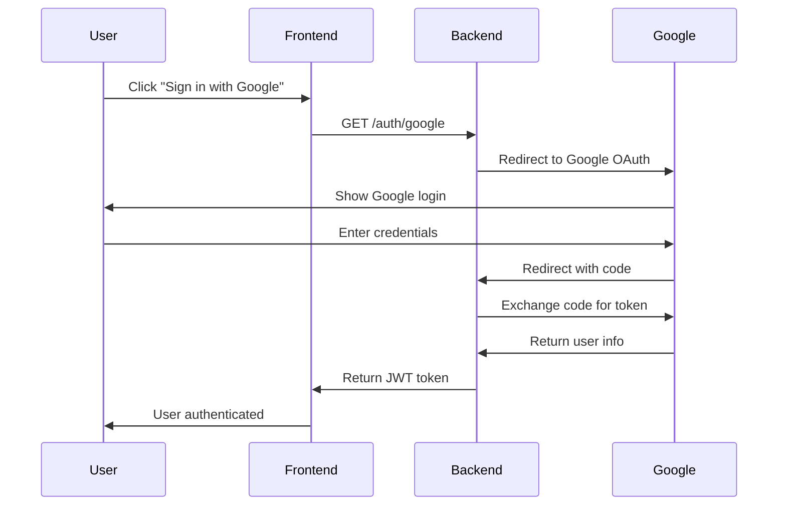
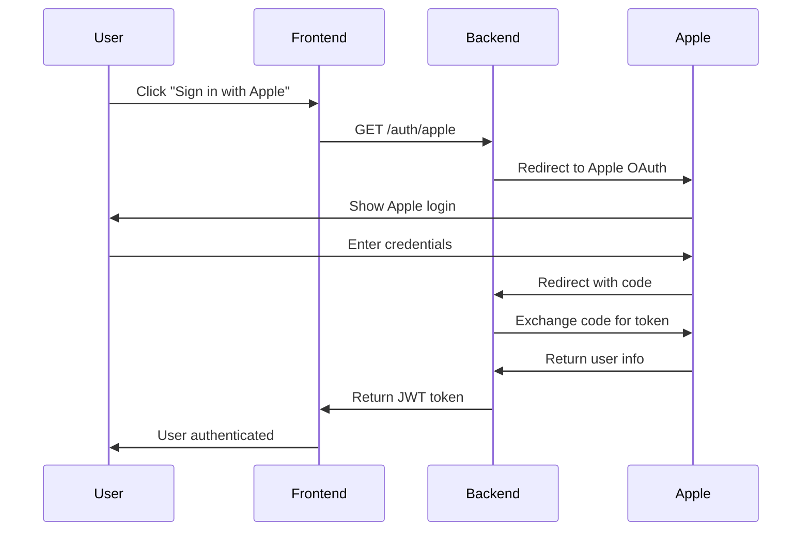

# 🔐 OAuth Setup Guide for VibeStream

## 📋 **OVERVIEW**

This guide explains how to set up real OAuth authentication with Google and Apple for VibeStream. The implementation replaces mock OAuth providers with actual API integrations.

## 🚀 **QUICK START**

### **1. Environment Configuration**

Copy the OAuth configuration template:
```bash
cp config/oauth.env .env
```

Edit `.env` with your OAuth credentials:
```env
# Google OAuth
GOOGLE_CLIENT_ID=your-google-client-id
GOOGLE_CLIENT_SECRET=your-google-client-secret
GOOGLE_REDIRECT_URI=http://localhost:3000/auth/google/callback

# Apple OAuth
APPLE_CLIENT_ID=your-apple-client-id
APPLE_TEAM_ID=your-apple-team-id
APPLE_KEY_ID=your-apple-key-id
APPLE_PRIVATE_KEY=your-apple-private-key
APPLE_REDIRECT_URI=http://localhost:3000/auth/apple/callback
```

### **2. Start the Server**

```bash
cd services/api-gateway
cargo run
```

### **3. Test OAuth Endpoints**

```bash
# Get available providers
curl http://localhost:3000/auth/providers

# Initiate Google OAuth
curl http://localhost:3000/auth/google

# Initiate Apple OAuth
curl http://localhost:3000/auth/apple
```

## 🔧 **GOOGLE OAUTH SETUP**

### **Step 1: Create Google Cloud Project**

1. Go to [Google Cloud Console](https://console.cloud.google.com/)
2. Create a new project or select existing one
3. Enable Google+ API and Google OAuth2 API

### **Step 2: Configure OAuth Consent Screen**

1. Go to "APIs & Services" > "OAuth consent screen"
2. Choose "External" user type
3. Fill in required information:
   - App name: "VibeStream"
   - User support email: your-email@domain.com
   - Developer contact: your-email@domain.com

### **Step 3: Create OAuth Credentials**

1. Go to "APIs & Services" > "Credentials"
2. Click "Create Credentials" > "OAuth 2.0 Client IDs"
3. Choose "Web application"
4. Set authorized redirect URIs:
   - `http://localhost:3000/auth/google/callback` (development)
   - `https://yourdomain.com/auth/google/callback` (production)

### **Step 4: Get Credentials**

Copy the Client ID and Client Secret to your `.env` file.

## 🍎 **APPLE OAUTH SETUP**

### **Step 1: Create Apple Developer Account**

1. Go to [Apple Developer Portal](https://developer.apple.com/)
2. Sign in with your Apple ID
3. Accept the developer agreement

### **Step 2: Create App ID**

1. Go to "Certificates, Identifiers & Profiles"
2. Click "Identifiers" > "+" to create new
3. Choose "App IDs" > "App"
4. Fill in:
   - Description: "VibeStream"
   - Bundle ID: `com.yourcompany.vibestream`
   - Capabilities: Enable "Sign In with Apple"

### **Step 3: Create Service ID**

1. Go to "Identifiers" > "+" > "Services IDs"
2. Fill in:
   - Description: "VibeStream Web"
   - Identifier: `com.yourcompany.vibestream.web`
3. Enable "Sign In with Apple"
4. Configure domains and redirect URLs:
   - Primary App ID: Select your App ID
   - Domains: `localhost:3000` (development), `yourdomain.com` (production)
   - Return URLs: `http://localhost:3000/auth/apple/callback`

### **Step 4: Create Private Key**

1. Go to "Keys" > "+" to create new key
2. Enable "Sign In with Apple"
3. Download the `.p8` file
4. Note the Key ID

### **Step 5: Get Credentials**

- **Client ID**: Your Service ID (`com.yourcompany.vibestream.web`)
- **Team ID**: Found in your Apple Developer account
- **Key ID**: From the key you created
- **Private Key**: Contents of the `.p8` file

## 🔄 **OAUTH FLOW**

### **Google OAuth Flow**



### **Apple OAuth Flow**



## 🛠️ **INTEGRATION WITH ANGULAR**

### **Angular Service Example**

```typescript
// auth.service.ts
import { Injectable } from '@angular/core';
import { HttpClient } from '@angular/common/http';
import { BehaviorSubject, Observable } from 'rxjs';

@Injectable({
  providedIn: 'root'
})
export class AuthService {
  private apiUrl = 'http://localhost:3000';
  private currentUserSubject = new BehaviorSubject<any>(null);
  public currentUser$ = this.currentUserSubject.asObservable();

  constructor(private http: HttpClient) {}

  // Get available OAuth providers
  getOAuthProviders(): Observable<any> {
    return this.http.get(`${this.apiUrl}/auth/providers`);
  }

  // Initiate Google OAuth
  initiateGoogleAuth(): void {
    window.location.href = `${this.apiUrl}/auth/google`;
  }

  // Initiate Apple OAuth
  initiateAppleAuth(): void {
    window.location.href = `${this.apiUrl}/auth/apple`;
  }

  // Handle OAuth callback (called by backend)
  handleOAuthCallback(): Observable<any> {
    return this.http.get(`${this.apiUrl}/auth/callback`);
  }
}
```

### **Angular Component Example**

```typescript
// login.component.ts
import { Component } from '@angular/core';
import { AuthService } from './auth.service';

@Component({
  selector: 'app-login',
  template: `
    <div class="login-container">
      <h2>Sign in to VibeStream</h2>
      
      <button (click)="signInWithGoogle()" class="google-btn">
        
        Sign in with Google
      </button>
      
      <button (click)="signInWithApple()" class="apple-btn">
        
        Sign in with Apple
      </button>
    </div>
  `
})
export class LoginComponent {
  constructor(private authService: AuthService) {}

  signInWithGoogle(): void {
    this.authService.initiateGoogleAuth();
  }

  signInWithApple(): void {
    this.authService.initiateAppleAuth();
  }
}
```

## 🔒 **SECURITY CONSIDERATIONS**

### **Environment Variables**
- Never commit OAuth credentials to version control
- Use different credentials for development and production
- Rotate credentials regularly

### **HTTPS in Production**
- OAuth requires HTTPS in production
- Use Let's Encrypt or similar for SSL certificates
- Update redirect URIs to use HTTPS

### **Token Security**
- JWT tokens are signed with a secret key
- Implement token refresh mechanism
- Set appropriate token expiration times

## 🧪 **TESTING**

### **Unit Tests**

```bash
cd services/api-gateway
cargo test oauth
```

### **Integration Tests**

```bash
# Test OAuth endpoints
curl -X GET http://localhost:3000/auth/providers
curl -X GET http://localhost:3000/auth/google
curl -X GET http://localhost:3000/auth/apple
```

## 🚨 **TROUBLESHOOTING**

### **Common Issues**

1. **Invalid redirect URI**
   - Ensure redirect URIs match exactly in OAuth provider settings
   - Check for trailing slashes and protocol (http vs https)

2. **Invalid client credentials**
   - Verify Client ID and Client Secret are correct
   - Check if credentials are for the right environment

3. **CORS issues**
   - Ensure your frontend domain is allowed in CORS settings
   - Check if preflight requests are handled correctly

### **Debug Mode**

Enable debug logging:
```env
RUST_LOG=debug
```

## 📚 **ADDITIONAL RESOURCES**

- [Google OAuth 2.0 Documentation](https://developers.google.com/identity/protocols/oauth2)
- [Apple Sign In Documentation](https://developer.apple.com/sign-in-with-apple/)
- [JWT.io](https://jwt.io/) - JWT token debugger
- [OAuth 2.0 Playground](https://oauth2.thephpleague.com/playground/) - Test OAuth flows

## 🎯 **NEXT STEPS**

1. ✅ Set up OAuth providers (Google, Apple)
2. ✅ Configure environment variables
3. ✅ Test OAuth flows
4. 🔄 Integrate with Angular frontend
5. 🔄 Implement user management
6. 🔄 Add refresh token support
7. 🔄 Set up production OAuth credentials

---

**¡OAuth real está listo para integrar con Angular!** 🚀

